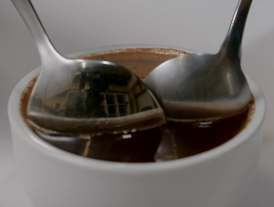

# Coffee Cupping

## Preperation

* JX-Pro grind setting: **2-8-0**
* Ratio:
    * **60g/1000ml**
    * **12g/200ml**
* If cup is 250ml. use **200ml** of water (it will bloom)
* cleanout grinder retention between coffee's with a handful of beans

### Stuff required as well

* X+2 cups, X for tasting + 2 for waste and rinse water
* 2 Cupping spoons

## Process

1. Put grounds into bowls
2. Pour water in them using scale
--- 
3. Wait 4 minutes
---
4. Stop the brewing process in all cups, use spoon to stir the top crust 3 times, so the grounds will sink to the bottom.
5. Use 2 spoons to scrape off the remaining crust on top.  
    
--- 
6. Wait 10 minutes
---
7. Use the cupping spoon to make slurpy noises

## References

* [Youtube.com - James Hoffmann - (Part 1) - How To Cup (Taste) Coffee At Home](https://www.youtube.com/watch?v=cSEgP4VNynQ)  
* [Youtube.com - James Hoffmann - (Part 2) - A Beginners Guide to Coffee Tasting](https://www.youtube.com/watch?v=kEZZCQTSSAg)  
