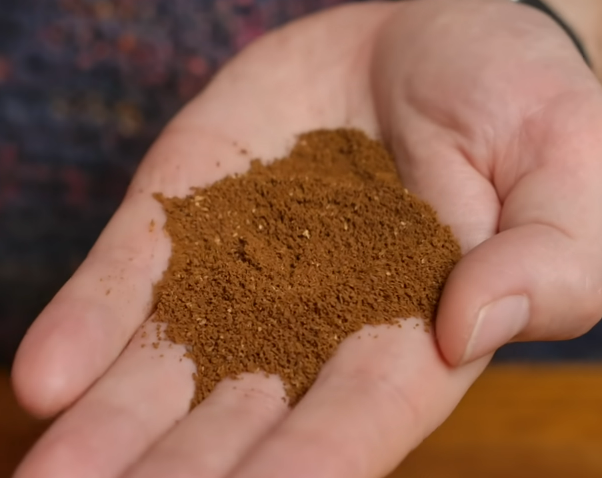

# Hoffmann V60 method - 1 cup

## Ratio
* 60g / 1000ml
* 1 cup: 15g/250ml
    * ~275ml in kettle

## Preparation

* Rinse paper with water
* Preheat plastic brewer - upside down on kettle
* Dig a little hole in the middle of the coffee grounds before pouring

## Brew

* Make sure all grounds get wet in initial pour (bloom)
    * use Swirl
    * use teaspoon to stirr (but not too much)
* Divide water in 20% blocks
    * 5 blocks of 50 grams

### Timings

> Its not that strict, make sure there remains water in the brewer between pours to keep it hot.

* **0:00**: Pour 50g to bloom
* **0:15**: Swirl
* **0:45**: Pour to 100g
* **1:10**: Pour to 150g
* **1:30**: Pour to 200g
* **1:50**: Pour to 250g
* **2:00**: Swirl

## Grind size
  
*Finer than you would think* - hoffmann

JX-Pro: ~**3-2-0**
> need to go finer, water goes through quickly (skonig)

## References

* [Youtube.com - James Hoffmann - A Better 1 Cup V60 Technique](https://www.youtube.com/watch?v=1oB1oDrDkHM)  
* [Youtube.com - James Hoffmann - 1 Cup V60 Part 2: You Had A Lot Of Questions!](https://www.youtube.com/watch?v=v5WQ1sZzW4o)